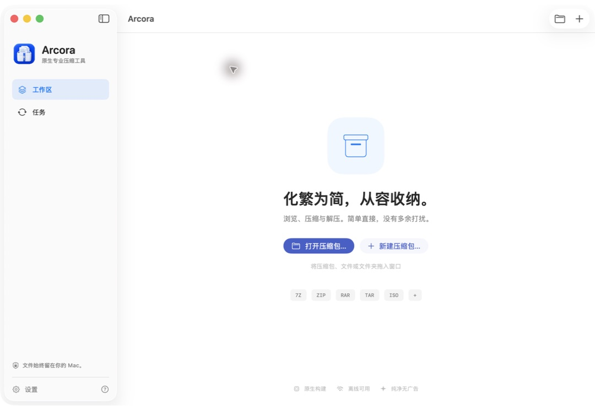

<p align="center"></p>

<h1 align="center">Arcora</h1>

**原生 macOS 压缩工具。本地处理，原生界面，清晰的格式支持边界。**

[English](README.md) · [简体中文](README.zh-CN.md) · [日本語](README.ja.md)

[](https://github.com/wybaby168/Arcora/actions/workflows/ci.yml)
[](LICENSE)


Arcora 使用 SwiftUI / AppKit 提供压缩、浏览、解压和完整性校验，支持 Apple Silicon 与 Intel Mac，内置简体中文、英文和日文界面。归档内容在本机处理，无需账号，没有文件上传服务、广告 SDK 或遥测。

> 本仓库提供源码和构建脚本，不是已公证的安装包。标准构建内置运行依赖，但**不包含商业 RAR 编码器或任何 RAR 许可证**。RAR 解压开箱即用；创建 RAR 需要完成下文的可选配置。

## 界面演示



42 秒了解真实 macOS 界面：浏览与解压、压缩与保护，再到 Finder 集成和设置。使用示例文件录制，切换节奏经过剪辑，不代表性能测试。RAR 解压内置；RAR 创建需要官方编码器和用户自己的许可证。

[查看静态总览](Documentation/Media/arcora-overview.png) · [演示说明](Documentation/README_MEDIA.md)

## 主要功能

- 原生归档浏览器：拖放、Finder 集成、搜索、排序、选中解压与 Quick Look。
- Finder 右键快速创建 ZIP、7z 和可选 RAR，并保留自定义压缩入口。
- 创建 7z、ZIP、TAR 系列及单文件压缩流，可选创建 RAR5。
- 按格式提供加密和分卷，7z / RAR 支持加密文件名。
- 任务队列、进度、暂停、继续、取消，以及线程和内存预算。
- 事务式输出：先在私有工作目录处理和校验，再提交结果，不静默覆盖已有文件。
- Universal App 打包，依赖版本和摘要固定，目标 Mac 无需安装 Homebrew。

## 格式支持

| 格式 | 浏览 / 解压 / 校验 | 创建 | 说明 |
| --- | --- | --- | --- |
| 7z | 内置 | 内置 | AES-256、文件名加密、分卷 |
| ZIP | 内置 | 内置 | AES-256 / ZipCrypto、数字分卷 |
| RAR4 / RAR5 | 内置 | 可选，仅 RAR5 | 标准版需要官方编码器及用户自己的许可证 |
| TAR、TAR.GZ、TAR.BZ2、TAR.XZ | 内置 | 内置 | 不提供加密或分卷创建 |
| GZ、BZ2、XZ | 内置 | 内置 | 每个压缩流仅接受一个普通文件 |
| 其他 7-Zip 格式 | 只读引擎接入 | 不开放 | 尚未穷尽所有格式变体的兼容性测试 |

更多只读格式和测试边界见[格式支持表](Documentation/FORMAT_SUPPORT.md)。不提供 RAR 修复、恢复记录、REV、SFX 创建或归档内部编辑。ZIP 创建要求 ASCII 密码，AES 密码最多 99 个字符；Unicode 密码请使用 7z 或 RAR。

## 构建与运行

构建需要 macOS 26+、Xcode 26+、已选择的对应命令行工具，以及 Python 3。构建机需要新版 CoreUI 工具来验证原生图标资源；生成的应用仍支持 macOS 14+。首次准备依赖需要联网。

```bash
git clone https://github.com/wybaby168/Arcora.git
cd Arcora
bash Scripts/bootstrap-engines.sh
bash Scripts/build-app.sh
open dist/Arcora.app
```

依赖脚本获取官方 7-Zip 26.03、libarchive 3.8.9 和 XZ 5.8.3 资产并校验固定 SHA-256。构建脚本生成 arm64 / x86_64 通用应用，保留所需上游原始源码包和许可说明。版本与摘要见 [engines.lock.json](Vendor/engines.lock.json)。

默认使用用于本地开发的 **ad-hoc 签名**。Developer ID 签名、Apple 公证和干净机器验收属于单独的[发行流程](Documentation/RELEASE.md)。Arcora 不会关闭 Gatekeeper，也不会通过清除下载隔离属性绕过 macOS 检查。

## Finder 右键快速压缩

将构建好的应用移入**应用程序**（系统或当前用户的 Applications 目录），打开一次。然后在 Finder 选中文件或文件夹，右键选择**服务 → Arcora — 快速压缩为 ZIP / 7z / RAR**。

快速操作默认创建**不加密**的压缩包，完成后校验，输出到原文件旁，保留原件；遇到同名自动编号，不覆盖。多个选中项合并成一个压缩包；来自不同目录时会询问输出位置。Arcora 显示进度并支持取消，完成后在 Finder 定位结果。应用未启动时也可通过服务直接启动。

macOS 可能先要求确认“运行服务”，允许后才交付所选文件；应用保留这项系统安全检查。

需要密码、分卷或其他设置时，选择 **Arcora — 自定义压缩…**。快速 RAR 与应用共用引擎和许可证检查；尚未配置时打开 RAR 设置表单，不会悄悄改为其他格式。

菜单未出现时，可在**设置 → 通用 → Finder 右键快速压缩**点击“刷新右键菜单”，并检查**系统设置 → 键盘 → 键盘快捷键 → 服务 → 文件和文件夹**。菜单位置和菜单语言由 macOS 决定；Arcora 不会强制启用用户关闭的服务。详见 [Finder 使用说明](Documentation/FINDER_SERVICES.md)及[本机验证记录](Documentation/FINDER_VALIDATION.md)。

## 可选 RAR 创建

在标准应用中打开**设置 → 引擎**：

1. 打开按本机硬件架构选择的 RARLAB 官方下载链接。
2. 导入未经修改的原始 `.tar.gz`。Arcora 核验版本、架构和 SHA-256，在用户私有应用数据目录完成配置。
3. 导入自己购买的 `rarreg.key`，确认使用权覆盖本次用途。官方引擎确认注册后，才启用创建。

不需要手工解压、命令行、Homebrew 或管理员安装。下载由用户主动在浏览器完成，Arcora 不提供运行时下载器或镜像。许可证仅保存在本机，不进入应用安装包，也不发送到服务器。未知或修改过的原包、无效许可证会被拒绝。

如果只在自己电脑上使用，可参阅[本地内置 RAR 构建](Documentation/LOCAL_RAR.md)。该私有版本的二进制、RAR 原包和注册文件不得上传到仓库或发行附件。本地使用仍受官方试用期限和许可证约束。

Arcora 的 MIT 许可不授予 RAR 使用权或分发权。本集成不代表 RARLAB 背书，也不能审计许可证来源或席位数量。请阅读 [RARLAB 条款](https://www.rarlab.com/license.htm)、[集成边界](Documentation/RAR_DELIVERY.md)及[许可证存储设计](Documentation/RAR_LICENSES.md)。

## 开发与验证

准备依赖后运行：

```bash
ARCORA_REQUIRE_7ZZ=1 bash Scripts/validate.sh
ARCORA_REQUIRE_7ZZ=1 swift test -c release
python3 Scripts/verify-app.py dist/Arcora.app
```

GitHub Actions 检查公开源码、三语文案、编译、基础回归及实际 Universal App，不下载 RAR，也不提供许可证。缺少可选 RAR 组件时，相应测试会明确跳过；基础 CI 成功不等于已验证真实许可证激活。私有 RAR 测试方法与未完成事项见[验证报告](Documentation/TEST_REPORT.md)。

开发 CLI 位于 `.build/debug/arcora-cli`，打包 CLI 位于 `dist/Arcora.app/Contents/Helpers/arcora`：

```bash
.build/debug/arcora-cli engines
.build/debug/arcora-cli inspect /path/to/example.rar
.build/debug/arcora-cli extract /path/to/example.rar --to /path/to/output
.build/debug/arcora-cli create --format 7z --output /path/to/archive.7z -- /path/to/documents
```

密码通过 `--password-stdin` 输入，不放入命令行参数。打包后的可执行文件忽略开发专用引擎路径覆盖。

## 安全与工程结构

Arcora 拒绝危险路径、链接和特殊文件，设置资源限制并复检提取内容。外部引擎是原生子进程，**不构成强 App Sandbox 隔离边界**；编解码器漏洞、恶意文件和资源耗尽风险仍然存在。它也不是完整 Unix 备份工具，不保证 ACL、所有者、资源分叉或全部扩展属性无损往返。

| 目录 | 职责 |
| --- | --- |
| `Sources/Arcora` | SwiftUI / AppKit 界面及翻译 |
| `Sources/ArcoraCore` | 归档服务、调度基础、安全检查及 RAR 配置 |
| `Sources/CArcora`、`Sources/ArcoraWorker` | libarchive 原生桥接与工作进程 |
| `Sources/ArcoraCLI` | 命令行接口 |
| `Tests`、`Scripts` | 回归样例、构建与验证工具 |

详见[架构说明](Documentation/ARCHITECTURE.md)、[安全设计](Documentation/SECURITY.md)及[漏洞报告方式](SECURITY.md)。

## 文档与贡献

- [English quick start](Documentation/QUICKSTART.en.md) · [中文用户指南](Documentation/USER_GUIDE.md) · [日本語クイックスタート](Documentation/QUICKSTART.ja.md)
- [贡献指南](CONTRIBUTING.md) · [macOS 验收清单](Documentation/MACOS_ACCEPTANCE.md)
- [验证范围与发行门槛](Documentation/TEST_REPORT.md)

提交问题时请提供 macOS 版本、源码版本、格式和不含敏感数据的最小复现。不要上传客户归档、密码或注册文件。欢迎改进通用格式行为、安全性、可访问性及本地化。

## 许可证

Arcora 原创代码和文档使用 [MIT 许可证](LICENSE)。第三方引擎和注明来源的测试样例保留各自许可，包括适用的 7-Zip / unRAR 限制。详见[第三方声明](THIRD_PARTY_NOTICES.md)。RAR 编码器属于商业专有软件，不在公开源码分发范围内。
